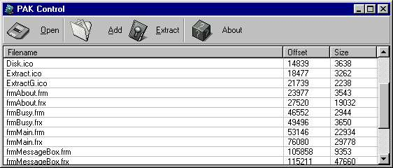



## PAK Control

### Description

With this code, you can merge multiples files (any file) in a one single file! It's fast and easy to understand.
 
### More Info
 

             |
---                |---
**Submitted On**   |2000-07-19 22:54:38
**By**             |[Tobe\_](https://github.com/Planet-Source-Code/PSCIndex/blob/master/ByAuthor/tobe.md)
**Level**          |Intermediate
**User Rating**    |5.0 (30 globes from 6 users)
**Compatibility**  |VB 3\.0, VB 4\.0 \(16\-bit\), VB 4\.0 \(32\-bit\), VB 5\.0, VB 6\.0, VB Script, ASP \(Active Server Pages\) 
**Category**       |[Files/ File Controls/ Input/ Output](https://github.com/Planet-Source-Code/PSCIndex/blob/master/ByCategory/files-file-controls-input-output__1-3.md)
**World**          |[Visual Basic](https://github.com/Planet-Source-Code/PSCIndex/blob/master/ByWorld/visual-basic.md)
**Archive File**   |[CODE\_UPLOAD79447202000\.zip](https://github.com/Planet-Source-Code/tobe-pak-control__1-9901/archive/master.zip)

